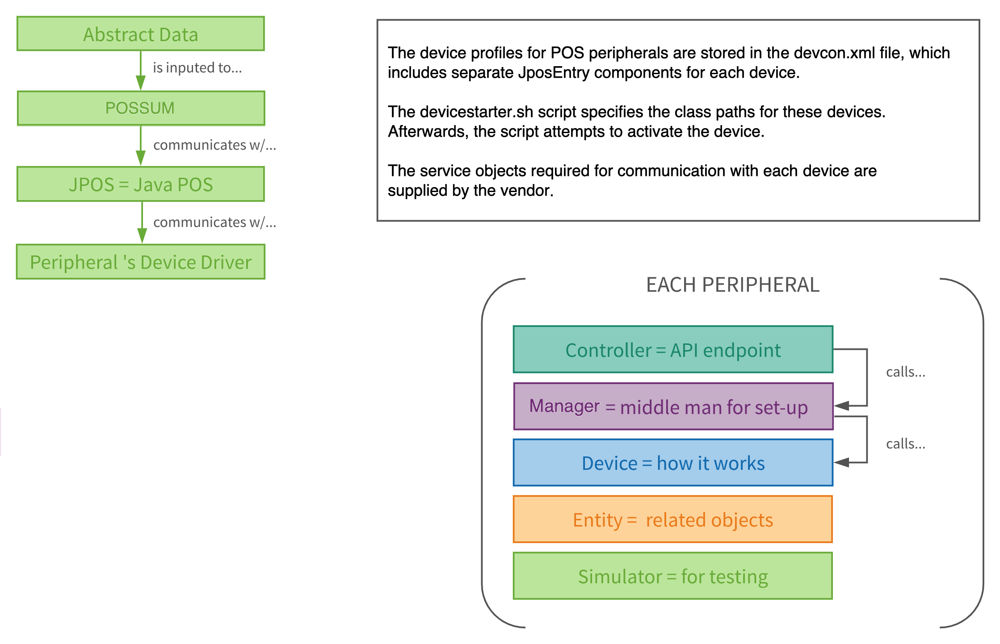
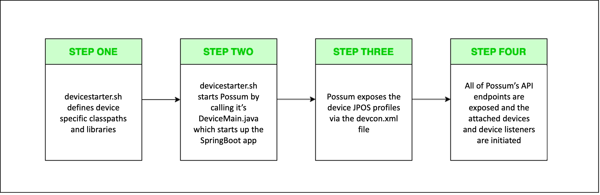

# POSSUM  
  
## Description
POSSUM is a Spring Boot framework Java project designed to present the functionality of all USB-connected POS peripherals that follow the JavaPOS spec (scanners, printer, lane light, line display, cash drawer, check reader, scale, etc.) as web services.  

Functionality provided by POSSUM will enable use outside of localhost for use by mobile applications, kiosks, and sharing between point of sale systems to create modern point of sale user experiences. 

## Team
POSSUM was created by Target Tech as an enterprise scale product to abstract point of sale peripheral hardware into discrete capabilities without regard to the differences between peripheral manufacturers and the implementation of their device drivers. This enables point of sale software developers to create point of sale software without hardware specific knowledge by calling simple web APIs for functions in a consistent manner.

POSSUM enables the following:

:white_check_mark: &nbsp;&nbsp;&nbsp; Creates operational efficiencies

:white_check_mark: &nbsp;&nbsp;&nbsp; Simplifies configuration management of retail peripherals

:white_check_mark: &nbsp;&nbsp;&nbsp; Increases flexibility in the hardware lifecycle events

:white_check_mark: &nbsp;&nbsp;&nbsp; Promotes competition through the commodification of peripheral devices

:white_check_mark: &nbsp;&nbsp;&nbsp; Enables software developers to create modern point of sale experiences

## Code Organization

<p align="center">
  
</p>
  
## Sequence Overview
  
<p align="center">
  
</p>
  
## Getting Started


### To fix CORS error (To whitelist new CORS Origins in Developer box)
Add origins to environment `CORS_ORIGINS` variable separated by a comma (,)

    `CORS_ORIGINS=http://localhost:8100,http://localhost:7777`
    
## Running POSSUM Locally
- Click the “Code” dropdown
- Copy the link to the project
- Go to your terminal, then enter "git clone (project link)"
- Enter your credentials (if prompted)
- Once cloned, go to your development environment and click open, and navigate to the project in your finder/folder.
- Ensure the project is configured to build using Java 17 
- Once opened, build the project using Gradle commands
- To run POSSUM on your local machine will require spring profile environment variable
- ```export SPRING_PROFILES_ACTIVE=local```
- To run simulator use ```./gradlew run -DuseSimulators=true```  

## Running POSSUM on a POS Computer
Requirements:
  - Java 17
  - POS Hardware drivers (provided by the manufacturer)
  - Note: ensure all dependencies for physical POS devices are installed (i.e. libusb for Honeywell scanners)

Verified Supported OS:
  - CentOS 7 
  - Ubuntu
  - NOTE: this is a Java application and can run many OS.

- Follow Running POSSUM Locally to ensure you are able to compile and run POSSUM (NOTE: this does not need to be done on a POS computer)
- Install the OS on the POS computer (refer to the Supported OS list above)
- Install Java 17 on POS computer
- Make the following directories:
  - `sudo mkdir /opt/target`
  - `sudo mkdir /opt/target/possum`
  - `sudo mkdir /opt/target/possum/externalLib`
- Compile POSSUM to create a jar file
- Copy jar file and following src/main/resource files from the development machine to the POS computer /opt/target/possum directory 
  - `devcon.xml`
  - `devicestarter.sh`
  - `ECIEncoding.csv`
  - `IHSParser.csv`
  - `LabelIdentifiers.csv`
  - `PossumDeviceManager-1.0.jar`
- Install necessary libraries and JPOS drivers for your hardware (i.e. Honeywell scanners require libusb)
- For devices not already supported, update the devcon.xml file
- Launch POSSUM:
  - Navigate to /opt/target/possum
  - To run use `sudo domenv=labs sh devicestarter.sh`

## API Specs
<details>
<summary>Scanner</summary>

| URL                                      | Description                                      | Parameters              | Response             |
|------------------------------------------|--------------------------------------------------|-------------------------|----------------------|
| 🟢`POST` /v1/scanner/reconnect           | Reconnects scanners                              | None                    | None                 |
| 🔵`GET`  /v1/scanner/healthstatus        | Reports scanners status                          | None                    | DeviceHealthResponse |
| 🔵`GET`  /v1/scanner/health              | Reports the health of both scanners              | None                    | DeviceHealthResponse |
| 🔵`GET` /v1/scanner/health/{scannerType} | Reports the health of one scanner                | HANDHELD, FLATBED, BOTH | DeviceHealthResponse |
| 🔵`GET` /v1/scan                         | Retrieve barcode data from connected scanner     | None                    | Barcode              |
| 🔴`DELETE` /v1/scan                      | Cancel previously requested scan                 | None                    | None                 |
| 🔵`GET` /v1/scan/{scannerType}           | Retrieve barcode data from one connected scanner | HANDHELD, FLATBED, BOTH | Barcode              |
</details>
<details>
<summary>Scale</summary>

| URL                             | Description                                                                                    | Parameters | Response             |
|---------------------------------|------------------------------------------------------------------------------------------------|------------|----------------------|
| 🟢`POST` /v1/scale/reconnect    | Reconnects scale                                                                               | None       | None                 |
| 🔵`GET`  /v1/stableweight       | Retrieves stable weight from scale. Use for selling weighted items.                            | None       | FormattedWeight      |
| 🔵`GET`  /v1/scale/healthstatus | Reports scale status                                                                           | None       | DeviceHealthResponse |
| 🔵`GET` /v1/scale/health        | Reports scale health                                                                           | None       | DeviceHealthResponse |
| 🔵`GET` /v1/liveweight          | Retrieves current weight from scale. For informational purposes only - DO NOT use for selling. | None       | SseEmitter           |
</details>
<details>
<summary>Printer</summary>

| URL                               | Description                                                                                    | Parameters        | Response             |
|-----------------------------------|------------------------------------------------------------------------------------------------|-------------------|----------------------|
| 🟢`POST` /v1/printer/reconnect    | Reconnects printer                                                                             | None              | None                 |
| 🟢`POST` /v1/print                | Sends entities to attached printer                                                             | Receipt Entities* | None                 |
| 🔵`GET`  /v1/printer/healthstatus | Reports printer status                                                                         | None              | DeviceHealthResponse |
| 🔵`GET` /v1/printer/health        | Reports printer health                                                                         | None              | DeviceHealthResponse |

*Includes any combination of BarcodeContent, ImageContent, and TextContent
</details>
<details>
<summary>Line Display</summary>

| URL                                   | Description                                                           | Parameters      | Response             |
|---------------------------------------|-----------------------------------------------------------------------|-----------------|----------------------|
| 🟢`POST` /v1/linedisplay/reconnect    | Reconnects line display                                               | None            | None                 |
| 🟢`POST` /v1/linedisplay/display      | Displays text on 2x20. To clear out a line, omit it from the request. | LineDisplayData | None                 |
| 🔵`GET`  /v1/linedisplay/healthstatus | Reports line display status                                           | None            | DeviceHealthResponse |
| 🔵`GET` /v1/linedisplay/health        | Reports line display health                                           | None            | DeviceHealthResponse |
</details>
<details>
<summary>Device Availability</summary>

| URL                                     | Description                          | Parameters                              | Response                   |
|-----------------------------------------|--------------------------------------|-----------------------------------------|----------------------------|
| 🔵`GET` /v1/peripherals                 | Reports list of attached peripherals | None                                    | DeviceAvailabilityResponse |
| 🔵`GET` /v1/health                      | Reports health for all devices       | None                                    | DeviceHealthResponse       |
| 🔵`GET`  /v1/deviceerror                | Reports errors for all devices       | None                                    | SseEmitter                 |
</details>
<details>
<summary>Check</summary>

| URL                              | Description                                                       | Parameters        | Response               |
|----------------------------------|-------------------------------------------------------------------|-------------------|------------------------|
| 🔵`GET` /v1/check                | Read data from a check or slip                                    | None              | MicrData               |
| 🟢`POST` /v1/check               | Print data on a check or slip                                     | CheckPrintData*   | None                   |
| 🔴`DELETE` /v1/check             | Cancel get check data call and/or eject the check from the MICR   | None              | None                   |
| 🟢`POST` /v1/check/reconnect     | Reconnect MICR                                                    | None              | None                   |
| 🔵`GET` /v1/check/healthstatus   | Reports MICR status                                               | None              | DeviceHealthResponse   |
| 🔵`GET` /v1/check/health         | Reports MICR health                                               | None              | DeviceHealthResponse   |


*Includes any combination of BarcodeContent, ImageContent, and TextContent
</details>
<details>
<summary>Cash Drawer</summary>

| URL                                 | Description                                                                       | Parameters | Response             |
|-------------------------------------|-----------------------------------------------------------------------------------|------------|----------------------|
| 🟢`POST` /v1/cashdrawer/reconnect   | Reconnect cash drawer                                                             | None       | None                 |
| 🟢`POST` /v1/cashdrawer/open        | Opens the cash drawer and waits until the cash drawer is closed before returning  | None       | None                 |
| 🔵`GET` /v1/cashdrawer/healthstatus | Reports cash drawer status                                                        | None       | DeviceHealthResponse |
| 🔵`GET` /v1/cashdrawer/health       | Reports cash drawer health                                                        | None       | DeviceHealthResponse |
</details>
<details>
<summary>Schemas</summary>

<details>
<summary>DeviceError</summary>

```
{
    code            string
    description     string
}
```
</details>
<details>
<summary>BarcodeContent</summary>

```
{
    type	    string (enum)
        [ TEXT, BARCODE, IMAGE ]
    data	    string
    barcodeType	    string (enum)
        [ UPCA, UPCE, JAN8, EAN8, JAN13, EAN13, TF, ITF, CODABAR, CODE_39, CODE_93, CODE_128, UPCA_S, UPCE_S, UPCD1, UPCD2, UPCD3, UPCD4, UPCD5, EAN8_S, EAN13_S, EAN128, OCRA, OCRB, CODE_128_PARSED, RSS14, RSS_EXPANDED, GS1DATABAR, GS1DATABAR_E, GS1DATABAR_S, GS1DATABAR_E_S, PDF417, MAXICODE, DATAMATRIX, QRCODE, UQRCODE, AZTEC, UPDF417, OTHER ]
    barcodeAlign    string (enum)
        [ LEFT, CENTER, RIGHT ]
    textLocation    string
        [ NONE, ABOVE, BELOW ]
    height	    integer ($int32)
    width	    integer ($int32)
}
```
</details>
<details>
<summary>ImageContent</summary>

```
{
    type            string (enum)
        [ TEXT, BARCODE, IMAGE ]
    data                string
    imageFormatType	string (enum)
        [ BMP, JPEG, GIF ]
}
```
</details>
<details>
<summary>PrinterContent</summary>

```
{
    type    string (enum)
        [ TEXT, BARCODE, IMAGE ]
    data    string
}
```
</details>
<details>
<summary>TextContent</summary>

```
{
    type    string (enum)
        [ TEXT, BARCODE, IMAGE ]
    data    string
}
```
</details>
<details>
<summary>PrinterError</summary>

```
{
    code	    string
    description	    string
}
```
</details>
<details>
<summary>LineDisplayData</summary>

```
{
    line1   string
    line2   string
}
```
</details>
<details>
<summary>CashDrawerError</summary>

```
{
    code            string
    description	    string
}
```
</details>
<details>
<summary>SseEmitter</summary>

```
{
    timeout integer ($int64)
}
```
</details>
<details>
<summary>ScaleError</summary>

```
{
    code            string
    description	    string
}
```
</details>
<details>
<summary>FormattedWeight</summary>

```
{
    weight  string
}
```
</details>
<details>
<summary>DeviceHealthResponse</summary>

```
{
    deviceName	    string
    healthStatus    string (enum)
        [ READY, NOTREADY ]
}
```
</details>
<details>
<summary>Barcode</summary>

```
{
    data    string
    type    string (enum)
        [ UPCA, UPCA_S, UPCE, UPCE_S, UPCD1, UPCD2, UPCD3, UPCD4, UPCD5, EAN8, JAN8, EAN8_S, EAN13, JAN13, EAN13_S, EAN128, TWO_OF_FIVE, INTERLEAVED_TWO_OF_FIVE, CODABAR, CODE39, CODE93, CODE128, OCRA, OCRB, RSS14, RSS_EXPANDED, GS1DATABAR, GS1DATABAR_E, CCA, CCB, CCC, PDF417, MAXICODE, DATAMATRIX, QRCODE, UQRCODE, AZTEC, UPDF417, OTHER, UNKNOWN ]
    source  string (enum)
        [ HANDHELD, FLATBED, BOTH ]
}
```
</details>
<details>
<summary>DeviceAvailabilityResponse</summary>

```
{
    possumversion    string
    confirmversion  string
    devicelist      DeviceConfigResponse
}
```
</details>
<details>
<summary>DeviceConfigResponse</summary>

```
{
    devicename	    string
    vidpid	    string
    usbport	    string
    manufacturer    string
    model	    string
    config	    string
    firmware	    string
    serialnumber    string
    isFunctional    boolean
    attached	    boolean
}
```
</details>
<details>
<summary>MicrError</summary>

```
{
    code            string
    description	    string
}
```
</details>
<details>
<summary>MicrData</summary>

```
{
    account_number      string
    bank_number         string
    transit_number      string
    raw_data            string
    sequence_number     string
}
```
</details>
</details>


## Dependencies and External Links

POSSUM as a project leverages JavaPOS standards and service objects. To learn more about JavaPOS follow the links below.

https://www.omg.org/retail/unified-pos.htm

https://github.com/JavaPOSWorkingGroup

https://repo1.maven.org/maven2/org/javapos/javapos/1.14.1/

## Supported Devices

Please note that POSSUM should be able to function with other devices in the categories listed provided the device is compatible with JPOS standards.  In order to onboard a new device from one of these categories, add the device entry to the devcon.xml and ensure the device is able to communicate with its service object provided by the device manufacturer.  

Flatbed Scanner
- Datalogic 2300 Scanner
- Datalogic 3550 Scanner
- Datalogic 8200 Scanner
- Datalogic 8400 Scanner Scale
- Datalogic 8400 Scanner
- Datalogic 8405 Scale
- Datalogic 9400 Scanner
- Datalogic 9400 Scanner Scale
- Zebra MP7000 Scanner
- Zebra MP7001 Scanner Scale

Handheld Scanner
- Honeywell 1900/1950 Scanner

MICR
- NCR 7167 MICR

Line Display
- NCR 5975 Line Display Serial
- NCR 5976 Line Display Serial
- NCR 5976 Line Display USB
- NCR 5977 Line Display USB

Receipt Printer
- NCR POS Printer F309
- NCR POS Printer 7167
- NCR POS Printer EPIC 7199
- NCR POS Printer USB 7199

Cash Drawer
- Cash Drawer ELO Computer
- Cash Drawer NCR Computer
- Cash Drawer NCR via printer port 

## Contributing to POSSUM

We welcome feature requests, bug reports and contributions for code and documentation.

### Reporting Issues

Reporting bugs can be done in the GitHub [issue tracker](https://github.com/target/possum/issues). Please search for existing issues first to help prevent duplicates.

### Code Contribution

POSSUM is already used in production environments, so any new changes/features/functionality must, where possible:

- Not alter existing behavior without an explicit config change
- Co-exist with older versions without disruption
- Must have a safe way to disable/roll-back

### Pull Requests

Patches are welcome, but we ask that any significant change start as an [issue](https://github.com/target/possum/issues/new) in the tracker, preferably before work is started.

Please ensure that all Pull Requests follow the provided template.  If you believe a particular test does not need to be done for your PR please note [na] next to the checkbox.

#### Device Changes Within Provided Components

As noted earlier POSSUM should be able to function with other devices in the categories listed provided the device is compatible with JPOS standards.

- Ensure proper unit tests are created corresponding to the device classes
- Verify that the changes do not impact simulator functionality
- Reach out to a Code Owner to test changes on physical devices

Please note that changes to device classes are not intended to be specific to a particular manufacturer.  Each component is intended to function regardless of manufacturer.  

#### Adding a New Device Component

Insert new device documentation here

### Testing

POSSUM relies heavily on physical device testing to ensure that production environments are not impacted.  As noted in our PR template, we request that contributers:
- Write proper unit tests with Mockito
- Utilize the existing simulator to test functionality
- Test on physical devices to ensure that existing functionality is not impacted (and note which devices are being tested in the 'Description of Testing' section)

We understand that testing on a physical device is not always possible.  Please reach out to an engineer to test code changes on physical devices:

@arpal7/
@LizZhang-00/
@AwesomestChris/
@rrenkor/
@bmcecilia3/